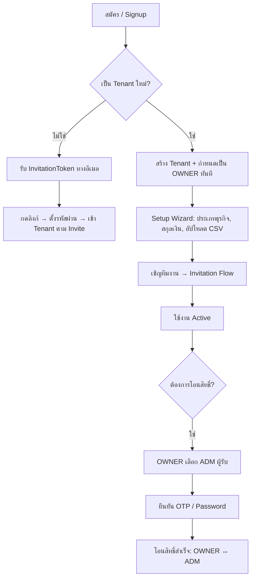

# Created At: 2026-04-12 00:00:00 +07:00 (v1.0.0b)
# Previous version: N/A
# Last Updated: 2026-04-12 00:00:00 +07:00 (v1.0.0b)

# FEAT21 — SaaS CRM Lifecycle & Ownership Transfer

**Status:** APPROVED ✅
**Version:** 1.0.0b
**Date:** 2026-04-12
**Author:** Claude (Architect) — derived from `.zdev/devlog/ideas/User Journey_ SaaS CRM Lifecycle & Ownership Transfer.md`
**Reviewer:** Boss (Product Owner)
**Task Log:** ZDEV-TSK-20260412-002
**Depends On:** FEAT01 (Multi-Tenant foundation + Employee model), FEAT02 (Employee profile structure)
**Related:** FEAT03 (Billing — OWNER rights), ADR-056 (Shared DB isolation)

---

## 1. Overview

ระบบนี้ครอบคลุม User Journey ตั้งแต่การ Onboarding ครั้งแรก จนถึงการโอนกรรมสิทธิ์ Workspace และการรองรับ Multi-Workspace ต่อผู้ใช้หนึ่งคน

**Core Value:** "ข้อมูลปลอดภัย — สิทธิ์โอนได้ — ทีมขยายได้ โดยไม่ต้อง re-onboard"

**ขอบเขตหลัก (Scope):**
1. **Invitation Flow** — เจ้าของเชิญพนักงานเข้าระบบอย่างปลอดภัยผ่าน Token
2. **Ownership Transfer** — โอนสิทธิ์ OWNER ระหว่างสมาชิก พร้อม OTP Guard
3. **OWNER Role** — สิทธิ์ระดับสูงสุดที่ปัจจุบันยังไม่มีในระบบ (Gap จาก Schema)
4. **Proxy Setup** — พนักงานเซต Workspace แทนเจ้าของ แล้วโอนสิทธิ์ให้ทีหลัง

> **หมายเหตุ:** Multi-Workspace Switcher (User คนเดียว หลาย Tenant) เป็น **Phase 2** —
> ต้องแก้ `@@unique` constraint บน `Employee.email` ก่อน ซึ่งเป็น Breaking Change ต้องมี ADR แยก

---

## 2. Terminology

| คำ | นิยาม |
|---|---|
| **OWNER** | บทบาทสูงสุด — จ่ายเงิน, ลบ Workspace, โอนสิทธิ์ได้ (มีได้ 1 คนต่อ 1 Tenant) |
| **ADM** | Admin — จัดการทีม, ดู Billing บางส่วน, **รับโอนสิทธิ์ได้** |
| **InvitationToken** | Token 1-use มีอายุ 7 วัน สำหรับเชิญสมาชิกใหม่ |
| **OwnershipTransferRequest** | บันทึกคำขอโอนสิทธิ์ที่รอการยืนยัน OTP |
| **Proxy Setup** | พนักงานที่เซต Workspace ก่อนเจ้าของเข้าระบบ ทำงานในฐานะ OWNER ชั่วคราว |

---

## 3. User Journey Map



---

## 4. Gap Analysis vs `prisma/schema.prisma`

### Summary

| # | Gap | Severity | Current State | Required Change |
|---|---|---|---|---|
| G1 | ไม่มี Role `OWNER` | 🔴 Critical | role = "ADM" (สูงสุด) | เพิ่ม "OWNER" เป็นค่าใหม่ |
| G2 | ไม่มี `InvitationToken` model | 🔴 Critical | ไม่มีระบบเชิญเข้าระบบ | เพิ่ม model ใหม่ |
| G3 | ไม่มี `OwnershipTransferRequest` model | 🔴 Critical | ไม่มีระบบโอนสิทธิ์ | เพิ่ม model ใหม่ |
| G4 | `Tenant` ไม่รู้ว่าใครเป็น OWNER | 🟡 High | ไม่มี FK กลับไป Employee | เพิ่ม `ownerEmployeeId` |
| G5 | `Employee.email` เป็น `@unique` แบบ Global | 🟡 High | ป้องกัน Multi-Workspace | Phase 2: เปลี่ยนเป็น `@@unique([email, tenantId])` |
| G6 | ไม่มี OTP/Verification table | 🟠 Medium | ไม่มี OTP storage | ครอบคลุมโดย G3 แล้ว |
| G7 | ไม่มี Audit Trail สำหรับ Role Change | 🟠 Medium | `CustomerActivity` มีแต่ใช้กับ Customer เท่านั้น | สร้าง `SystemAuditLog` model |
| G8 | Idea ใช้ `Membership` model แยก | 🟢 Info | ใช้ `Employee.tenantId` แทน | ไม่ต้องเปลี่ยน Phase 1 |

### Gap รายละเอียด

**G1 — ไม่มี Role `OWNER`** — `ADM` คือสูงสุดในปัจจุบัน แต่ OWNER ต้องการสิทธิ์พิเศษเพิ่ม (Billing, Delete Workspace, Transfer) และมีได้ 1 คนต่อ Tenant เท่านั้น Migration impact: ต้องอัปเดต `can()` ใน `src/lib/can.js` ทุก permission check

**G2 — ไม่มี `InvitationToken`** — ปัจจุบัน Admin สร้าง Employee ให้เองทั้งหมด (manual) ต้องรู้รหัสผ่านพนักงาน ไม่ปลอดภัยและ scalable

**G3 — ไม่มี `OwnershipTransferRequest`** — ถ้าจะเปลี่ยน Owner ตอนนี้ต้องให้ Dev แก้ DB ตรง เป็น security risk

**G4 — `Tenant` ไม่มี `ownerEmployeeId`** — ต้องสแกน employees table ทุกครั้งเพื่อหา OWNER O(n) per request

**G5 — `Employee.email @unique` แบบ Global** — ป้องกัน Multi-Workspace (คนคนเดียวอยู่ได้แค่ Tenant เดียว) เป็น Breaking Change ผลักไป Phase 2 พร้อม ADR แยก

**G6 — OTP Table** — ครอบคลุมแล้วโดย `OwnershipTransferRequest.otpHash` ไม่ต้องสร้าง Table แยก

**G7 — Role Change Audit** — `CustomerActivity` ใช้กับ Customer events เท่านั้น ต้องสร้าง `SystemAuditLog` แยกสำหรับ System events (OWNERSHIP_TRANSFER, ROLE_CHANGE, MEMBER_INVITE, MEMBER_JOIN)

**G8 — Membership Pattern** — Idea ใช้ `Membership` junction table แต่ Architecture ปัจจุบันใช้ `Employee.tenantId` (1:1) แทน ไม่ต้องเปลี่ยน Phase 1 เพราะ Refactor ใหญ่เกินคุ้ม

### Priority Implementation Order

```
Phase 1 (FEAT21 v1.0.0):
  G4 → เพิ่ม Tenant.ownerEmployeeId       [Migration + Code]
  G1 → เพิ่ม OWNER role + can() update    [Code only]
  G2 → เพิ่ม InvitationToken model        [Migration + API + UI]
  G3 → เพิ่ม OwnershipTransferRequest     [Migration + API + UI]
  G7 → เพิ่ม SystemAuditLog model         [Migration + Logger]

Phase 2 (FEAT21 v2.0.0 — ต้องมี ADR แยก):
  G5 → Employee.email @unique → @@unique([email, tenantId])
       + Workspace Switcher UI
       + NextAuth Multi-tenant Session
```

---

## 5. Schema Changes (v1.0.0b)

### 5.1 เพิ่ม Role: OWNER

```prisma
// roles ที่รองรับ (บันทึกเป็น String เพื่อ backward compat)
// STF | SLS | AGT | MGR | ADM | MKT | OWNER
// *** OWNER เป็น role ใหม่ที่ต้องเพิ่ม ***
```

**Constraint:** Tenant ต้องมี OWNER ได้เพียง 1 คน — enforce ที่ Application Layer

### 5.2 เพิ่ม `ownerEmployeeId` ใน Tenant

```prisma
model Tenant {
  // ... existing fields ...
  ownerEmployeeId String? @map("owner_employee_id") // *** NEW — String? หลีกเลี่ยง circular FK ***
}
```

### 5.3 เพิ่ม `InvitationToken` model

```prisma
model InvitationToken {
  id          String    @id @default(uuid())
  tenantId    String    @map("tenant_id")
  token       String    @unique
  email       String
  role        String    @default("STF")
  invitedById String    @map("invited_by_id")
  usedAt      DateTime? @map("used_at")       // null = ยังไม่ได้ใช้
  expiresAt   DateTime  @map("expires_at")    // now() + 7 days
  createdAt   DateTime  @default(now()) @map("created_at")

  @@index([tenantId])
  @@index([token])
  @@map("invitation_tokens")
}
```

### 5.4 เพิ่ม `OwnershipTransferRequest` model

```prisma
model OwnershipTransferRequest {
  id             String    @id @default(uuid())
  tenantId       String    @map("tenant_id")
  fromEmployeeId String    @map("from_employee_id") // OWNER ปัจจุบัน
  toEmployeeId   String    @map("to_employee_id")   // ADM ผู้รับ
  otpHash        String    @map("otp_hash")          // bcrypt hash ของ OTP
  status         String    @default("PENDING")       // PENDING | CONFIRMED | CANCELLED | EXPIRED
  expiresAt      DateTime  @map("expires_at")        // now() + 15 min
  confirmedAt    DateTime? @map("confirmed_at")
  createdAt      DateTime  @default(now()) @map("created_at")

  @@index([tenantId])
  @@map("ownership_transfer_requests")
}
```

### 5.5 เพิ่ม `SystemAuditLog` model

```prisma
model SystemAuditLog {
  id        String   @id @default(uuid())
  tenantId  String   @map("tenant_id")
  type      String   // OWNERSHIP_TRANSFER | ROLE_CHANGE | MEMBER_INVITE | MEMBER_JOIN
  actorId   String   @map("actor_id")   // Employee.id ผู้กระทำ
  targetId  String?  @map("target_id")  // Employee.id ที่ถูกกระทำ
  metadata  Json     @default("{}")
  createdAt DateTime @default(now()) @map("created_at")

  @@index([tenantId])
  @@index([type])
  @@map("system_audit_logs")
}
```

---

## 6. Feature Specifications

### 6.1 Invitation Flow

**Trigger:** OWNER หรือ ADM กด "เชิญทีมงาน" ใน `/settings/team`

**Flow:**
1. System สร้าง `InvitationToken` (UUID + expiresAt 7d)
2. ส่งอีเมลไปยังผู้รับ: `https://{slug}.zuri.app/join?token={uuid}`
3. ผู้รับเปิดลิงก์ → หน้า Join Page ตรวจสอบ Token (ยังไม่ถูกใช้, ยังไม่หมดอายุ)
4. ผู้รับตั้งชื่อ + รหัสผ่าน → ระบบสร้าง `Employee` ใน Tenant นั้นทันที
5. Mark `InvitationToken.usedAt = now()`

**Business Rules:**
- Token 1-use เท่านั้น
- อีเมลที่ถูกเชิญต้องยังไม่มีใน Tenant นั้น
- Role ที่กำหนดใน Invite ≠ OWNER (ห้ามเชิญคนใหม่เป็น OWNER ตั้งแต่แรก)

### 6.2 Ownership Transfer Flow

**Pre-condition:** ผู้โอน = OWNER ปัจจุบัน, ผู้รับ = ADM ใน Tenant เดียวกัน

**Flow:**
```
OWNER → POST /api/settings/ownership/initiate
  ├── Validate: toEmployeeId เป็น ADM จริง
  ├── สร้าง OTP (6 หลัก, TTL 15 นาที)
  ├── บันทึก OwnershipTransferRequest (PENDING)
  └── ส่ง OTP ทางอีเมล OWNER

OWNER → POST /api/settings/ownership/verify { otp }
  ├── ดึง Request ที่ PENDING ล่าสุด
  ├── ตรวจสอบ bcrypt.compare(otp, otpHash)
  ├── ตรวจสอบ expiresAt > now()
  ├── prisma.$transaction([
  │     Employee.update(from → role: "ADM")
  │     Employee.update(to   → role: "OWNER")
  │     Tenant.update(ownerEmployeeId: to)
  │     OwnershipTransferRequest.update(CONFIRMED)
  │     SystemAuditLog.create(OWNERSHIP_TRANSFER)
  │   ])
  └── Invalidate sessions ทั้งสองฝ่าย → Force re-login
```

**Security Rules:**
- ใช้ `prisma.$transaction` ป้องกัน Race Condition (ห้าม Tenant มี OWNER > 1 คน)
- OTP bcrypt hash ก่อนเก็บ (cost factor 12)
- หลังโอนสำเร็จ: Invalidate session เก่าของทั้งสองฝ่าย ผ่าน `ActiveSession` table
- Log ทุก Transfer ใน `SystemAuditLog`

### 6.3 Proxy Setup Flow

**สถานการณ์:** เจ้าของให้พนักงานเซตระบบแทน

1. พนักงานสมัครด้วยอีเมลตัวเอง → กลายเป็น OWNER ชั่วคราว
2. พนักงานเชิญเจ้าของเข้ามาผ่าน Invitation Flow (role: ADM)
3. หลังเจ้าของตั้งค่าครบ → ดำเนินการโอนสิทธิ์ตาม 6.2
4. เจ้าของกลายเป็น OWNER, พนักงานกลายเป็น ADM

---

## 7. Roles & Permissions Matrix

| Action | OWNER | ADM | MGR | STF/SLS/AGT/MKT |
|---|---|---|---|---|
| โอนสิทธิ์ | ✅ | ❌ | ❌ | ❌ |
| รับโอนสิทธิ์ | — | ✅ (ต้องเป็น ADM ก่อน) | ❌ | ❌ |
| เชิญสมาชิก | ✅ | ✅ | ❌ | ❌ |
| ลบสมาชิก | ✅ | ✅ | ❌ | ❌ |
| จัดการ Billing | ✅ | 👁 ดูได้ | ❌ | ❌ |
| ลบ Workspace | ✅ | ❌ | ❌ | ❌ |
| ตั้งค่าระบบ | ✅ | ✅ | ❌ | ❌ |

### `can()` Updates ที่จำเป็น

```javascript
// src/lib/can.js
const PERMISSIONS = {
  // ... existing ...
  team: {
    invite:    ['OWNER', 'ADM'],
    remove:    ['OWNER', 'ADM'],
    list:      ['OWNER', 'ADM', 'MGR'],
  },
  ownership: {
    initiate:  ['OWNER'],
    verify:    ['OWNER'],
    cancel:    ['OWNER'],
    view:      ['OWNER'],
  },
  billing: {
    manage:    ['OWNER'],
    view:      ['OWNER', 'ADM'],
  },
  workspace: {
    delete:    ['OWNER'],
    configure: ['OWNER', 'ADM'],
  }
}
```

---

## 8. API Endpoints

### 8.1 Invitation Flow

| Method | Path | Auth | Description |
|---|---|---|---|
| `POST` | `/api/team/invite` | OWNER/ADM | สร้าง InvitationToken + ส่งอีเมล |
| `GET` | `/api/team/invite/:token/validate` | Public | ตรวจสอบ Token ก่อน Join |
| `POST` | `/api/team/join` | Public + Token | สร้าง Employee ใหม่ (transaction) |
| `GET` | `/api/team/invitations` | OWNER/ADM | รายการ Invitation ที่รอการตอบรับ |
| `DELETE` | `/api/team/invite/:token` | OWNER/ADM | ยกเลิก Invitation |

**POST `/api/team/invite` — Request/Response:**
```json
// Request
{ "email": "staff@example.com", "role": "SLS", "name": "สมชาย ดีใจ" }

// 201 Created
{ "success": true, "token": "uuid", "expiresAt": "...", "inviteUrl": "https://..." }

// 400 — role = OWNER
{ "error": "INVALID_ROLE", "message": "ไม่สามารถเชิญด้วย Role OWNER ได้โดยตรง" }

// 409 — email ซ้ำ
{ "error": "ALREADY_MEMBER", "message": "อีเมลนี้มีบัญชีในระบบแล้ว" }
```

**POST `/api/team/join` — Core Transaction:**
```javascript
await prisma.$transaction(async (tx) => {
  const invite = await tx.invitationToken.findFirst({
    where: { token, usedAt: null, expiresAt: { gt: new Date() } }
  })
  if (!invite) throw new Error('TOKEN_INVALID')

  await tx.employee.create({
    data: {
      tenantId: invite.tenantId,
      email: invite.email,
      firstName, lastName,
      role: invite.role,
      roles: [invite.role],
      passwordHash: await bcrypt.hash(password, 12),
      employeeId: generateEmployeeId(),
    }
  })

  await tx.invitationToken.update({
    where: { id: invite.id },
    data: { usedAt: new Date() }
  })
})
```

---

### 8.2 Ownership Transfer Flow

| Method | Path | Auth | Description |
|---|---|---|---|
| `GET` | `/api/settings/ownership` | OWNER | ดูสถานะ + รายชื่อ ADM ที่โอนให้ได้ |
| `POST` | `/api/settings/ownership/initiate` | OWNER | เริ่มกระบวนการ → สร้าง OTP |
| `POST` | `/api/settings/ownership/verify` | OWNER | ยืนยัน OTP → โอนสิทธิ์จริง |
| `DELETE` | `/api/settings/ownership/cancel` | OWNER | ยกเลิก Request ที่ PENDING |

**POST `/api/settings/ownership/initiate` — Flow:**
```javascript
// 1. Validate recipient เป็น ADM ของ Tenant เดียวกัน
const toEmployee = await EmployeeRepo.findByIdAndTenant(toEmployeeId, tenantId)
if (!toEmployee || toEmployee.role !== 'ADM')
  return Response.json({ error: 'RECIPIENT_NOT_ADMIN' }, { status: 400 })

// 2. Cancel PENDING request เก่า
await OwnershipRepo.cancelPending(tenantId)

// 3. สร้าง OTP + hash
const otp = String(Math.floor(100000 + Math.random() * 900000))
const otpHash = await bcrypt.hash(otp, 12)
const expiresAt = new Date(Date.now() + 15 * 60 * 1000)

// 4. บันทึก + ส่งอีเมล OWNER
await OwnershipRepo.createRequest({ tenantId, fromEmployeeId, toEmployeeId, otpHash, expiresAt })
await sendOtpEmail({ to: session.user.email, otp, toEmployeeName: toEmployee.firstName })
```

**POST `/api/settings/ownership/verify` — Atomic Transaction:**
```javascript
// ตรวจ OTP + expiry ก่อน
const isValid = await bcrypt.compare(otp, request.otpHash)
if (!isValid) return Response.json({ error: 'INVALID_OTP' }, { status: 400 })
if (new Date() > request.expiresAt) return Response.json({ error: 'OTP_EXPIRED' }, { status: 400 })

// Atomic swap — ป้องกัน 2 OWNER พร้อมกัน
await prisma.$transaction(async (tx) => {
  await tx.employee.update({ where: { id: request.fromEmployeeId }, data: { role: 'ADM', roles: ['ADM'] } })
  await tx.employee.update({ where: { id: request.toEmployeeId },   data: { role: 'OWNER', roles: ['OWNER'] } })
  await tx.tenant.update({ where: { id: tenantId }, data: { ownerEmployeeId: request.toEmployeeId } })
  await tx.ownershipTransferRequest.update({ where: { id: request.id }, data: { status: 'CONFIRMED', confirmedAt: new Date() } })
  await tx.systemAuditLog.create({ data: { tenantId, type: 'OWNERSHIP_TRANSFER', actorId: fromEmployeeId, targetId: request.toEmployeeId, metadata: { requestId: request.id } } })
})

// Invalidate sessions ทั้งสองฝ่าย
await SessionRepo.revokeAll(request.fromEmployeeId)
await SessionRepo.revokeAll(request.toEmployeeId)
```

---

## 9. Security Checklist

| Item | Requirement | Note |
|---|---|---|
| OTP bcrypt hash ก่อนเก็บ | ✅ Required | cost factor 12 |
| OTP TTL 15 นาที | ✅ Required | `expiresAt` check |
| Transfer ใช้ `prisma.$transaction` | ✅ Required | ป้องกัน 2 OWNER |
| Invalidate session หลังโอน | ✅ Required | `ActiveSession` table |
| Invite Token 1-use | ✅ Required | `usedAt` field |
| Invite Token TTL 7 วัน | ✅ Required | `expiresAt` check |
| `can()` guard ทุก endpoint | ✅ Required | ห้าม bypass |
| Audit log ทุก Transfer | ✅ Required | `SystemAuditLog` |
| Rate limit Invite API | 🟡 Recommended | 10 req/hr per tenant |
| Email confirm ทั้งสองฝ่ายหลังโอน | 🟡 Recommended | Notify ทั้ง from + to |

---

## 10. UI Screens

| หน้า | Path | ผู้ใช้ |
|---|---|---|
| เชิญทีมงาน | `/settings/team` | OWNER/ADM |
| หน้า Join (รับเชิญ) | `/join?token=xxx` | Public |
| โอนสิทธิ์ | `/settings/account/ownership` | OWNER |
| ยืนยัน OTP | `/settings/account/ownership/confirm` | OWNER |

---

## 11. Implementation Notes

### Backward Compatibility
- Role `OWNER` เป็น String ใหม่ → ไม่ใช้ Enum ป้องกัน migration ซับซ้อน
- Existing Tenants: Employee แรกสุด (createdAt ASC) ของแต่ละ Tenant → set เป็น OWNER
- Migration script: `UPDATE employees SET role = 'OWNER' WHERE ...`

### Phase 2 (Future — ต้องมี ADR แยก)
- เปลี่ยน `Employee.email @unique` → `@@unique([email, tenantId])`
- อัปเดต NextAuth ให้ออก JWT per-tenant-session
- สร้าง Workspace Switcher UI

---

## 12. Related Documents
- FEAT01-MULTI-TENANT.md (Base Architecture)
- FEAT02-PROFILE.md (Employee Profile)
- FEAT03-BILLING.md (Billing — OWNER Rights)
- ADR-056: Multi-Te