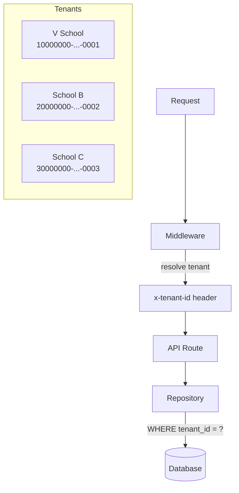

# Architectural Law: Multi-Tenancy

- **Identification**: Every core table MUST have a `tenant_id` column.
- **Resolution**: Middleware resolves tenant from domain/context and injects `x-tenant-id` header.
- **UI Branding**: Use `TenantContext` for all UI branding. Never hardcode tenant-specific UI.
- **Default (V School)**: `10000000-0000-0000-0000-000000000001`
- **Isolation**: Handled by the Repository Pattern ensuring all queries use `tenantId`.
