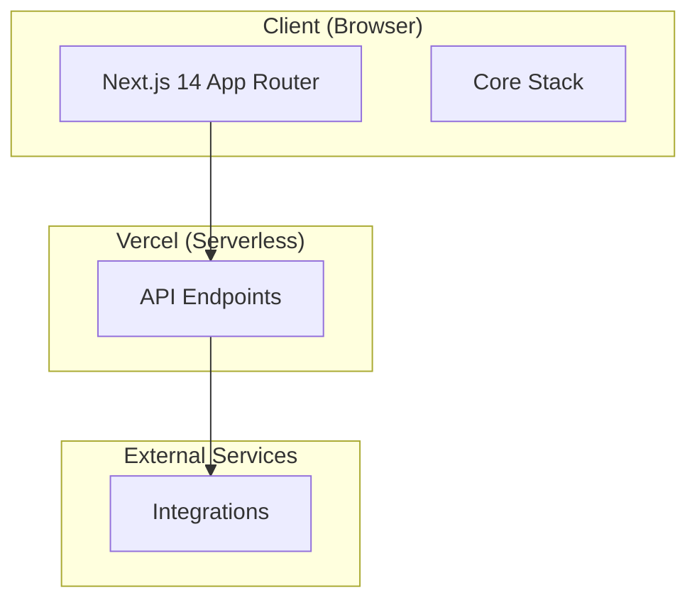

# Zuri Platform — Technology Stack (Navigator)

This document is the SSOT for the project's technology stack layers.

---

| Layer | Component Detail | Spec Path |
|---|---|---|
| **Core** | Next.js 14, JS (NOT TS), Prisma, Redis, Pusher, QStash | [docs/architecture/stack/core.md](file:///e:/zuri/docs/architecture/stack/core.md) |
| **Integrations** | FB, LINE OA, Meta Ads, Gemini AI, Upstash | [docs/architecture/stack/integrations.md](file:///e:/zuri/docs/architecture/stack/integrations.md) |
| **Endpoints** | API paths (Conversations, Customers, OCR, Workers) | [docs/architecture/stack/endpoints.md](file:///e:/zuri/docs/architecture/stack/endpoints.md) |

---
**Related Documents:**
- [PROJECT_MAP.md](file:///e:/zuri/docs/PROJECT_MAP.md)
- [LAWS.md](file:///e:/zuri/docs/architecture/LAWS.md)
