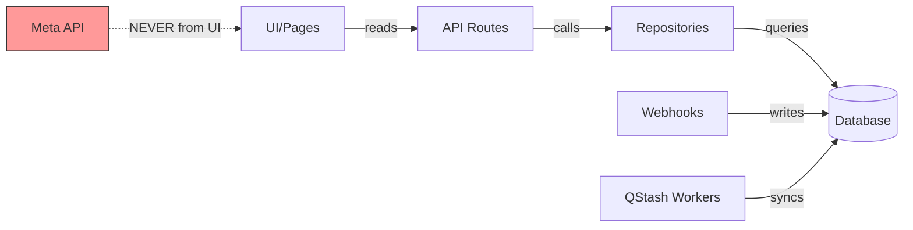

# Architectural Law: Data Flow & Integrity

- **UI Status**: Reads from DB only. Never call Meta Graph API or LINE Messaging API directly from components.
- **Workers**: QStash workers sync external data -> DB every 1 hour (`/api/workers/sync-hourly`).
- **Webhooks**: FB/LINE webhooks write inbound messages to DB. Respond 200 immediately (NFR1: < 200ms).
- **Realtime**: Pusher triggers realtime updates to connected clients.
