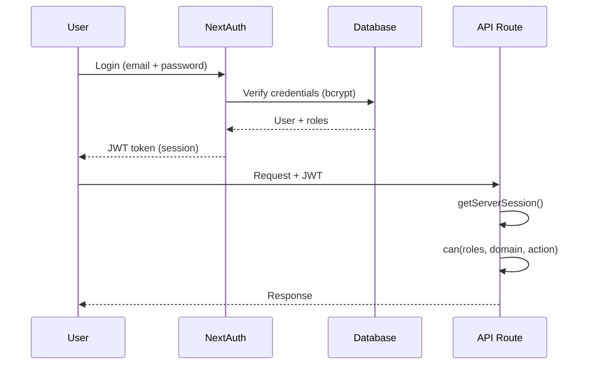

# Architectural Law: RBAC & Security

- **Roles**: DEV, OWNER, MANAGER, SALES, KITCHEN, FINANCE, STAFF.
- **Enforcement**: Use `can(roles, domain, action)` centralized in `src/lib/permissionMatrix.js`.
- **Storage**: Roles are stored in `Employee.roles[]` (array of UPPERCASE strings).
- **Session**: NextAuth v4 handles session via JWT strategy.
